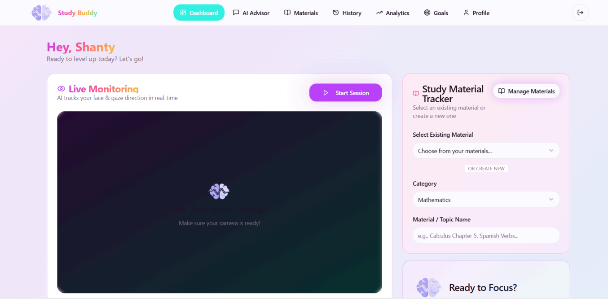
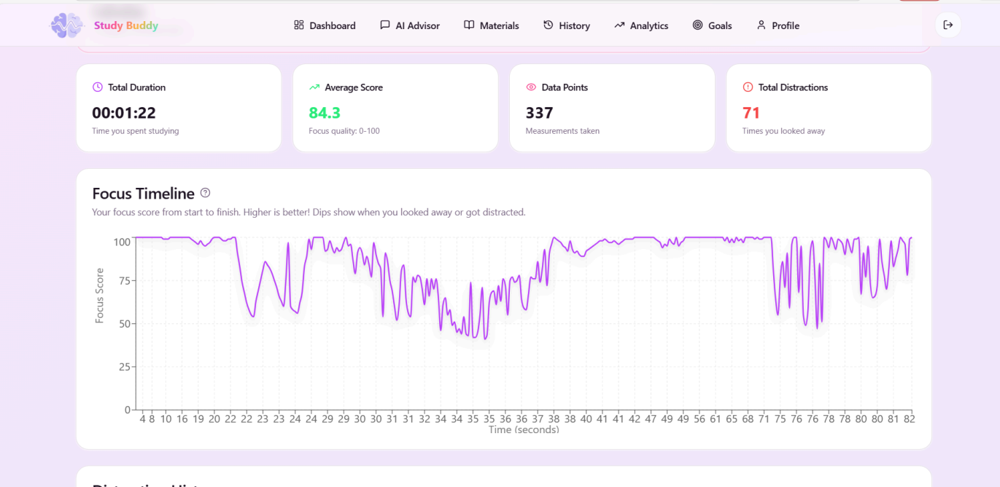
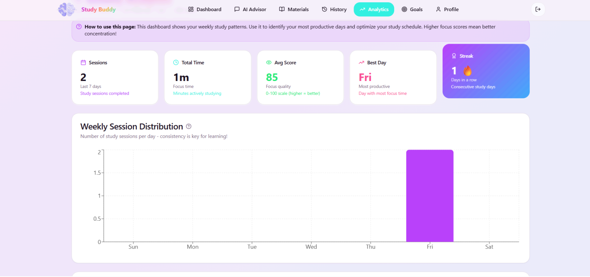
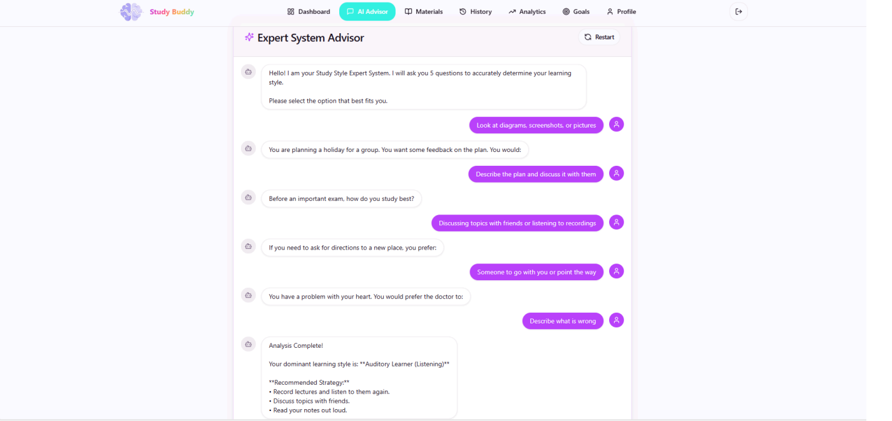

# 🧠 BrainFocusAI — Study Buddy


BrainFocusAI (project codename: **Study Buddy**) is an AI-powered learning companion that combines **real-time focus monitoring**, **facial biometric authentication**, and **AI-driven study recommendations** to help students stay productive during self-directed learning sessions.

The platform uses gaze tracking, head pose estimation, facial recognition, and rule-based expert logic to analyze concentration levels and generate personalized learning insights.

---

# 📚 Table of Contents

* Overview
* Key Features
* Tech Stack
* System Architecture
* Methodology
* AI Components
* Dashboard & Analytics
* Results
* Installation
* Future Improvements
* Authors
* References
* License

---

# 🎯 Overview

Traditional online learning environments often struggle with two major problems:

* Maintaining student focus
* Securing user authentication

BrainFocusAI addresses both challenges by integrating:

* Face Recognition Login
* Real-Time Gaze Tracking
* Focus Quality Monitoring
* AI Study Advisor
* Learning Analytics Dashboard

The system was developed as a web-based platform using React, FastAPI, Supabase, and Computer Vision technologies. The research behind this project was published in *IT FOR SOCIETY Vol.09 No.01*.

---

# ✨ Key Features

## 🔐 Face Authentication

* MiniFaceNet-based face recognition
* Triplet Loss embedding learning
* 128-dimensional facial embeddings
* One-shot user registration

## 🛡 Anti-Spoofing Security

* Laplacian Variance blur detection
* Detects printed photos
* Detects screen replay attacks
* Allows only verified live users

## 👀 Real-Time Focus Tracking

* MediaPipe Face Mesh (468 landmarks)
* Eye movement tracking
* Iris position estimation
* Head pose analysis
* Dynamic focus scoring system

## 🤖 AI Study Advisor

* Personalized study recommendations
* Learning style analysis
* Rule-Based Expert System
* Gemini-powered feedback generation

## 📊 Productivity Analytics

* Focus Quality Tracking
* Effective Study Duration
* Weekly Session Statistics
* Learning Consistency Streak
* Historical Performance Reports

---

# 🏗 System Architecture

```text
Frontend (React + TypeScript)
            │
            ▼
 MediaPipe Face Mesh
  Gaze Tracking Engine
            │
            ▼
     Focus Score System
            │
            ▼
 FastAPI Backend (Python)
            │
    ┌───────┴────────┐
    ▼                ▼
Face Recognition   AI Advisor
(MiniFaceNet)      (Gemini API)
    │                │
    └───────┬────────┘
            ▼
     Supabase Database
```

---

# ⚙ Tech Stack

| Layer            | Technology                |
| ---------------- | ------------------------- |
| Frontend         | React + TypeScript        |
| Backend          | FastAPI                   |
| Database         | Supabase PostgreSQL       |
| Face Tracking    | MediaPipe Face Mesh       |
| Face Recognition | MiniFaceNet               |
| Deep Learning    | TensorFlow                |
| Authentication   | Facial Embedding Matching |
| AI Advisor       | Google Gemini             |
| Analytics        | Recharts                  |
| Deployment       | Supabase Edge Functions   |

---

# 🧠 AI Components

## Face Recognition

The biometric authentication module uses a custom MiniFaceNet architecture trained with Triplet Loss.

Pipeline:

1. Face Detection
2. Image Normalization
3. Feature Embedding Generation
4. Cosine Similarity Matching
5. Identity Verification

Configuration:

* Input Size: 160×160
* Embedding Size: 128-D
* Similarity Threshold: 0.75

---

## Focus Detection Engine

The focus tracking system combines:

### Head Pose Estimation

Uses:

* Nose Tip
* Forehead
* Chin

to estimate viewing direction.

### Iris Tracking

Uses:

* Left Eye
* Right Eye
* Iris Centers

to estimate gaze position.

### Fusion Formula

```text
Gtotal = 0.4(Hpose) + 0.6(Ioffset)
```

where eye movement receives greater importance than head movement.

---

## AI Recommendation Engine

The platform integrates Google Gemini to generate personalized study recommendations.

The recommendation system evaluates:

* Focus quality
* Study duration
* Learning habits
* User responses

and generates actionable study strategies.

---

# 📈 Dashboard & Analytics

BrainFocusAI provides multiple analytics modules:

### Weekly Session Distribution

Track study frequency across days.

### Focus Quality Trends

Analyze concentration changes over time.

### Performance Summary

Session-based reports including:

* Focus score
* Effective duration
* Study statistics

### AI Learning Profile

Identifies dominant learning styles and generates personalized recommendations.

---

# 📸 Application Preview

## Main Dashboard



## Weekly Analytics



## Session Summary



## AI Advisor



---

# 📊 Results

### Face Authentication

* 40 verification attempts
* 4 registered users
* High identification accuracy
* Robust embedding separation

### Liveness Detection

| Scenario       | Result  |
| -------------- | ------- |
| Live User      | Granted |
| Digital Screen | Blocked |
| Printed Photo  | Blocked |

### Focus Monitoring

The hybrid gaze tracking approach successfully combines eye movement and head pose estimation to provide real-time attention monitoring while maintaining low computational overhead.

---

# 🚀 Installation

## Clone Repository

```bash
git clone https://github.com/tintinbunyispeda/BrainFocusAI.git

cd BrainFocusAI
```

## Backend

```bash
cd backend

python -m venv .venv

source .venv/bin/activate
# Windows
.venv\Scripts\activate

pip install -r requirements.txt

uvicorn main:app --reload
```

## Frontend

```bash
cd frontend

npm install

npm run dev
```

Open:

```text
http://localhost:5173
```

---

# 🔮 Future Improvements

* Browser extension for tab activity monitoring
* Real-time push notifications
* Enhanced focus prediction models
* Mobile application support
* PDF performance report export
* Subject-based comparative analytics
* Fine-tuned AI advisor model

---

# 👥 Authors

* Cristine Valentina
* Johana Veronica Setiawan
* Nisrina Izza Nur Aisyah
* Shanty
* Deffa Rahadiyan

---

# 📄 Publication

Development of an AI-Powered Monitoring System Using Gaze Tracking and Rule-Based Expert Logic for Enhanced Self-Directed Learning. IT FOR SOCIETY Vol.09 No.01.

---

# 📜 License

Released under the MIT License.
